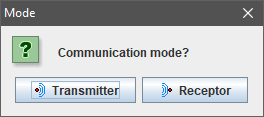

# Controller
 A Java based program to control another computer, sending inputs and receiving it's screen image

## Usage
Each computer, provided they are connected within a local network, can take the role of a **transmitter** or a **receiver**. The **transmitter** gives it's inputs to the **receiver**, and can receive it's screen image.

You can press `Shift-SpaceBar` to see the **receiver**'s screen image.

To pause the program, drag the cursor to the top-right corner of the screen.

You can close the program by right-clicking it's icon on the taskbar, or pressing `Shift-Escape`.

## Instalation
Provided you have *Java Runtime Environment (JRE)* installed, it can be simply loaded and will be ready to use.
